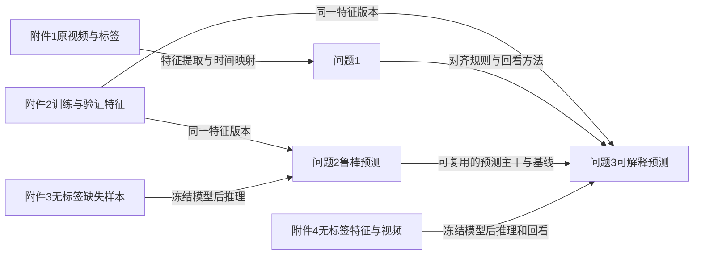

# 2026 E 题：题意与数据核验

> 阶段：读题与附件清点；日期：2026-09-23。来源为本地赛题 DOCX 和已解压的四组附件。本报告记录要求与已观察事实，不填写模型结果。

## 0 赛题档案

| 项目 | 内容 |
|---|---|
| 年份、题号 | 2026 年中国研究生数学建模竞赛 E 题 |
| 题面内标题 | 复杂场景下多模态情感预测的数学建模与算法设计 |
| 文件名差异 | DOCX 文件名使用“识别”，题面内标题使用“预测”；论文题目引用时按题面内标题核对官方模板 |
| 命题方 | 题面未标注，不据题号推断 |
| 题型 | 多模态时序数据驱动预测、缺失鲁棒性与局部可解释性 |
| 数据边界 | 只使用题目提供的 CMU-MOSEI 系列数据；允许开源特征提取工具、预训练模型和算法框架，但需标明名称、版本、参数与用途 |

## 1 逐项任务解释

| 编号 | 题面要求 | 可执行解释 | 误读后果 |
|---|---|---|---|
| S01 | 附件1为 100 条原始视频，样本由 `video_id` 和 `clip_id` 共同确定 | 以二元组为主键，不按文件名或文本去重 | 样本与标签错位 |
| S02 | 标签强度在 [-3,3]；0 仅属中性 | 回归输出连续强度；三分类单独输出，0 不能同时算正负 | 分类映射错误 |
| S03 | 不得替换、增补、删除或修改附件1样本及标签 | 保留原件与全量索引；异常片段只在处理时掩码或截断并记录 | 问1覆盖率不合格 |
| S04 | 附件2含 aligned 和 unaligned 两套特征，各 4850 条 | 选定一套接口做训练、验证及专项推理；不可混用 | 维度和时间口径不一致 |
| S05 | 附件3的“缺失”是模态内随机连续零值区间，不是整模态消失 | 在有效长度内定位缺失区间；区分缺失零与填充零 | 鲁棒实验与测试场景不匹配 |
| S06 | 附件4完整三模态，配原视频回看证据 | 解释需给模态作用与可定位的文本、语音或视觉片段 | 只给注意力权重难以复核 |
| S07 | 问1从附件1提取文本、音频、视觉特征并时序对齐 | 明确工具、特征定义、时间映射、有效长度、填充、日志 | 生成特征无法追溯到原素材 |
| S08 | 问1需汇总全部 100 条样本并展示至少 1 条典型样本 | 生成逐样本汇总表和文字、音频、视频共同时间轴 | 只展示个案而漏全量结果 |
| S09 | 问2预测极性与强度，分析缺失类型、位置、时长 | 两任务同时报告；设计分层缺失实验与消融 | 只做单一缺失率或单一指标 |
| S10 | 问3输出极性、强度、主参考模态、作用程度和局部证据 | 每个附件4样本有预测行与解释行，并能回看原视频 | 缺少关键证据定位 |
| S11 | 问2、问3在附件2训练集学习，在验证集选结构、超参和阈值 | 附件3、4只做最终无标签推理，不用于调参 | 专项测试集信息泄漏 |
| S12 | 分类用 Accuracy、F1；回归用 MAE、Pearson | 验证集统一输出四指标与误差分析 | 指标不全或口径混乱 |
| S13 | 核心材料和专项结果文件随附件提交，总量不超过 50 MB | 保留必要代码、配置、参数、100条特征和 CSV，提前核算压缩大小 | 最终附件超限或不可复现 |

## 2 已核对的附件清单

| 附件 | 本地观察 | 题面给出的结构或用途 | 核验状态 |
|---|---|---|---|
| 1 | 100 个 `.mp4`；`label-100.xlsx` 存在 | 100 条原始样本；视频标识、转写、强度和极性 | 文件数已核，行与键待核 |
| 2 | `aligned_50.pkl` 993,842,861 字节；`unaligned_50.pkl` 2,897,003,035 字节；`label.xlsx` 存在 | 各 4850 条，按 train/valid/test 字段组织；aligned 三模态最长 50 位 | 文件存在且大小已核，内部键、划分数与标签待核 |
| 3 | 对齐、未对齐版本各 30 个 `.pkl` | 无标签局部缺失样本 | 文件数已核，样本 ID 与实际零段待核 |
| 4 | 对齐、未对齐版本各 20 个 `.pkl` 与 20 个 `.mp4` | 无标签完整模态样本与解释回看视频 | 文件数已核，样本 ID 与时间映射待核 |

题面说明：aligned 的文本、语音、视觉特征分别为 `(N,50,768)`、`(N,50,74)`、`(N,50,35)`；unaligned 的语音与视觉长度为 500。上述形状尚需从文件读取后验证。`text_bert` 是文本编码输入，不是第四模态。题面没有给语音 74 维每一维的物理含义，不应擅自解释。

## 3 硬约束与交付物

| 范围 | 硬约束 | 应留存的证据 |
|---|---|---|
| 全题 | 不引入题外情感数据集参与训练、微调、调参或结果统计 | 数据来源和运行配置 |
| 全题 | 开源工具、预训练模型、框架须注明名称、版本、参数、使用场景 | 环境文件、配置、模型说明 |
| 问1 | 100 条全部保留并可追溯，输出特征的有效位置和填充规则可核验 | 主键清单、处理日志、时间映射与特征文件 |
| 问2、问3 | 训练、验证、专项推理使用同一 aligned 或 unaligned 版本 | 数据版本配置与输入检查 |
| 问2、问3 | 专项测试无标签，只输出最终推理结果 | 冻结模型和阈值后生成的 CSV |
| 提交 | 正文覆盖三问的方法、求解、结果；核心代码、参数、说明和结果 CSV 随附件；附件 ≤50 MB | 论文与附件清单、可复运行说明 |

## 4 跨问关系

问2、问3按题面直接在附件2训练，不要求将问1自行提取的 100 条特征混入训练。问1建立的时间映射方法可用于问3的证据核对。

## 5 待核实事项

| 编号 | 事项 | 若情况 A | 若情况 B | 下一步 |
|---|---|---|---|---|
| C01 | 题面“4850 条”是每套全体样本数还是有效样本数 | train+valid+test 合计 4850 | 存在筛选或重复索引 | 读取各划分数量和 ID 唯一性 |
| C02 | 附件3/4单个 `.pkl` 的字段与标签占位 | 与附件2完全同字段 | 字段精简或新增缺失标记 | 安全读取样本并写接口适配器 |
| C03 | 对齐位置到视频秒数的映射是否保存在特征文件 | 可直接定位 | 只能借原视频重建时间戳 | 检查字段；必要时对视频及转写重做强制对齐 |
| C04 | `label-100.xlsx` 的主键能否与 100 个视频一一匹配 | 全匹配 | 有命名差异或缺项 | 比较二元主键并记录例外 |
| C05 | 题面与 DOCX 文件名中的“预测/识别”用词不一致 | 题面内标题为准 | 当届模板另有正式题名 | 以当届官方模板最终核对 |

## 6 遗漏审计与一句话题意

四组附件、三问、四项评价指标、两类专项 CSV、100 条特征、可复现材料与 50 MB 限额均已登记。尚未核验 `.pkl` 内部结构、Excel 主键及时间戳，不能据此声称数据清洗或模型训练完成。

**一句话题意：** 用题给视频和特征建立可追溯的三模态时序表示，完成局部缺失下的情感预测与能回看证据的解释预测。
