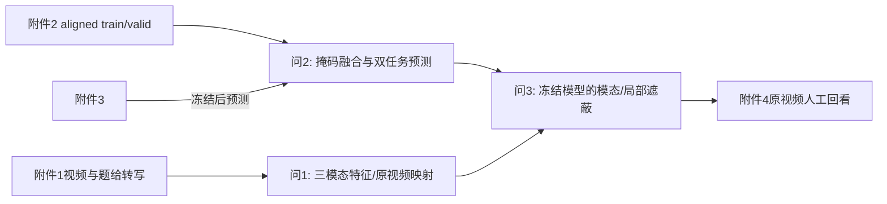

# 建模思路报告 · 2026 E 复杂场景下多模态情感预测的数学建模与算法设计

> 题型族：数据驱动多模态时序预测与证据回映｜命题方：题面未标注｜依据：正式题面、《cpgmcm-2026-E-题意翻译.md》。本报告是选型逻辑，不在此填写实验分数。

## 0 一句话内核

让三种异步且局部不可靠的情感线索进入同一可追溯表示，在缺失时仍能预测，并说明每次判断依据的原视频片段。

## 1 题型族判定与候选模型池

| 判定依据 | 结论 |
|---|---|
| 输入为英文转写、声学、视觉序列，输出三类极性及连续强度 | 多模态时序监督学习；不能只做聚类或主观赋权 |
| 问2强调有效范围内局部连续零段 | 需要显式观测状态与遮蔽压力测试 |
| 问3要求原文本/音频/视频证据 | 需要可回映的局部扰动或可检验解释，而非仅给注意力热图 |

候选池限定为：问1的固定时间窗/词驱动对齐与显式时间映射；问2的掩码池化线性基线、轻量共享Transformer、可靠性门控；问3的模态/局部遮蔽敏感性及互补的人工视频核查。缺失模态生成模型和大模型直接打分不进入主线：题给标注规模与时间戳条件不足以验证其额外复杂性。

## 2 全文主线

### 2.1 主线模型

一条“原素材—有效位置—观测状态—预测—可回看证据”的链条。问1用预训练BERT、OpenSMILE、OpenFace形成自主特征与原视频映射；问2固定附件2的 aligned_50 输入，构造文本、声学、视觉段表示，显式区分填充、观测和人为遮蔽，训练轻量分类/回归联合融合器；问3冻结同一预测器，对模态与局部段做系统遮蔽，以预测变化生成待人工验证的证据。问1的自主特征不混入附件2训练集。

### 2.2 辅助模型

掩码池化统计加岭回归/逻辑回归作为低容量参照；干净输入教师和人工缺失学生可作为鲁棒性候选。局部遮蔽解释需配原视频人工核查，避免把模型敏感性误写成因果关系。

### 2.3 主线贯穿示意

## 3 逐问方案对比

### 3.1 问一：100条原视频特征与对齐

| 候选模型 | 适用条件 | 数据要求 | 优点 | 风险 | 实现难度 | 建议 |
|---|---|---|---|---|---|---|
| 固定视频时间窗，三模态各自提取后聚合 | 有视频/音轨/转写及媒体时长 | 100条原视频与标注索引 | 每个窗可直接回到视频秒数，适合全量表 | 语词边界不等于窗边界；静音样本无法提供声学语义 | 中：提取、映射、异常日志 | 主方案；明确缺音频/缺脸的有效位 |
| 词驱动强制对齐，按词聚合声画 | 转写与实际说话匹配且音轨有效 | 可稳定识别的语音和词时戳 | 文本证据直观 | 低匹配、全静音或音乐样本会给伪时戳 | 高：逐条核查失败样本 | 仅在锚点可信的片段辅助使用 |
| 直接把附件2的aligned特征当问1输出 | 问1允许复用已处理特征 | 附件2与附件1逐条同源且有原视频映射 | 省提取时间 | 题面要求“自行生成”，且附件2未给逐词时间戳 | 低 | 不采用 |

### 3.2 问二：局部缺失鲁棒预测

| 候选模型 | 适用条件 | 数据要求 | 优点 | 风险 | 实现难度 | 建议 |
|---|---|---|---|---|---|---|
| 掩码池化统计 + 正则化逻辑/岭回归 | 特征语义稳定、样本数有限 | 3395 train，728 valid；同版特征 | 参数少、可作为下界和诊断 | 池化丢失缺失位置与连续区间结构 | 低 | 必做基线 |
| 轻量共享Transformer双任务融合 | 15个模态段token、固定特征版本；缺失标记可靠 | 同上，另有随机遮蔽种子 | 保留段位置与跨模态交互，支持同一主干解释 | 仅5个文本段导致10%等低缺失率离散；位置语义非真实秒数 | 中：三种子训练、验证、消融 | 主候选；以valid和压力测试判定 |
| 完整教师—缺失学生蒸馏 | 教师在干净输入上稳定，学生见有效范围内人工缺失 | 训练集加可追溯随机遮蔽 | 可研究缺失下的性能变化 | 教师偏差会传给学生；学生未必胜过教师 | 中：多种子及双模型对照 | 作为候选组件，不预设必然优于教师 |
| 特征重建/扩散生成缺失片段 | 缺失真值可辨、生成质量可测 | 大量配对完整样本及验证算力 | 理论上可利用跨模态互补 | 原有零值与抽取失败不易区分；生成伪证据难复核 | 高：训练和质量评估 | 不进提交主线 |

### 3.3 问三：可回看解释预测

| 候选模型 | 适用条件 | 数据要求 | 优点 | 风险 | 实现难度 | 建议 |
|---|---|---|---|---|---|---|
| 冻结问2模型，逐模态及五段遮蔽 | 可复用同一输入接口和模型；保存原预测概率 | 附件2 valid、附件4特征与20段原视频 | 每个差值可重算，可与视频审查结合 | 零输入会落出训练分布；差值不是因果重要性 | 中：20条×多扰动，审查 | 主候选；必须注明敏感性语义 |
| 注意力权重热图 | Transformer暴露注意力 | 模型权重、token映射 | 计算便宜 | 注意力不保证预测依赖，也不能独立证明原视频证据 | 低 | 仅作辅助图，不能单独满足题意 |
| 人工视频标注的证据片段监督模型 | 有大量人工标注证据 | 题给仅20个无标签专项视频 | 可直观评估解释质量 | 证据真值不足，专项不能用于训练选择 | 高 | 不采用；20条只做盲式审查 |

## 4 选型结论与理由

问1采用固定时间窗做全量可追溯提取，ASR词级锚点只用于可核查的音轨；问2选择容量受控的共享融合器并保留线性基线，训练时的人工遮蔽必须记录种子、实际有效位与比例；问3沿用冻结的预测主干并做可复算遮蔽，同时回看原视频。选择的共同原因是能够使用题给数据在四天内复现，并能把失败样本留在记录中。任何教师—学生或可靠性门控的收益都须由同口径 valid 对照证明，不能因结构名称直接认定改进。

## 5 验证路线

| 模型 | 独立验证方式 | 需要的数据/实验 | 预期结论强度 |
|---|---|---|---|
| 问1时序映射 | 100条主键与时长/有效位审计，至少1条视频人工逐段回看；低匹配样本单列 | 原视频、题给转写、提取日志 | 证明覆盖率和定位质量；不能证明所有ASR秒数精确 |
| 问2融合 | 只在valid做四指标、分类型/位置/比例压力测试、线性基线对照、多随机种子 | 附件2 train/valid、固定遮蔽方案 | 支持本划分上的经验比较；不能代替独立外测 |
| 问2蒸馏 | 同一随机遮蔽下比较教师、学生和集成 | 固定valid掩码与种子 | 若差异小或区间跨零，只写未证实增益 |
| 问3遮蔽解释 | 合成已知有/无模态的一致性检查、局部/全局遮蔽复算、原视频人工回看 | valid标签、附件4原视频与时间映射 | 证明输出可复算和部分证据合理性；不是因果识别 |

## 6 创新点清单

### 6.1 可争取的实质贡献

1. 三种掩码语义加实际遮蔽率日志，使局部缺失分析可复算；需与不区分零值的基线同口径比较，并报告实现代价。
2. 自主特征的原视频时间映射及失败标记，使问1、问3证据可回看；需报告锚点接受率和人工核查差错。
3. 冻结预测主干上的双层遮蔽与视频核查闭环；需统计人审支持/矛盾/不确定比例，并展示反例。

这些是可验证的贡献候选，是否称为“性能创新”须等独立证据，不预先宣称。

### 6.2 不建议计入创新点

给标准Transformer换名字、用注意力图替代解释、只凭单一seed提升称鲁棒、对无标签专项报告准确率，都不成立。

## 7 论文结构草图

| 章节 | 内容 | 对应模型 | 预计篇幅 |
|---|---|---|---|
| 摘要 | 三问、方法、可核实数字、局限 | 全文 | ≤2页 |
| 问题重述/分析 | 任务边界、数据接口和依赖 | 题意报告 | 2–3页 |
| 假设/符号 | 数据版本、掩码、标签及时间定义 | 全文 | 1–2页 |
| 问1 | 原视频提取、映射、100条总表和案例 | 固定时间窗/ASR辅助 | 4–5页 |
| 问2 | 网络与损失、四指标、压力测试、消融与错误 | 基线/融合/蒸馏 | 5–7页 |
| 问3 | 遮蔽方法、典型卡、局部图、人工回看 | 冻结融合器 | 4–5页 |
| 评价与局限 | 版本一致性、外测限制、失效样本 | 全文 | 1–2页 |
| 参考文献/附录 | 已核实文献、运行说明和文件清单 | 全文 | 按当届模板 |

篇幅是写作规划，最终以官方当届模板的限制为准。

## 8 风险与备用方案

| 风险 | 触发条件 | 备用方案 |
|---|---|---|
| 问1音轨与转写不一致 | ASR锚点低匹配或全静音 | 保留窗口级特征，词秒数标不确定，不强行对齐 |
| 问2文本低比例压力测试失真 | 五段token下遮一段已约20%位置且有效率更高 | 明报实际比例，或改用更细分文本表示后重训全部链路 |
| Transformer对valid过拟合 | 种子方差高、与基线差异不稳 | 退回正则化基线，不再用复杂结构包装提升 |
| 蒸馏无收益 | 学生在同缺失场景无稳定优势 | 只保留教师推理，蒸馏作为阴性实验 |
| 问3时间回映不可信 | 视频与ASR文本错位 | 仅给特征位置与原话，不给伪精确秒数；人工标注可核实片段 |
| 最终附件超限 | 压缩包超过50MB | 在不删除问1原始特征要求的前提下压缩数值与删冗余缓存，重验读取 |
