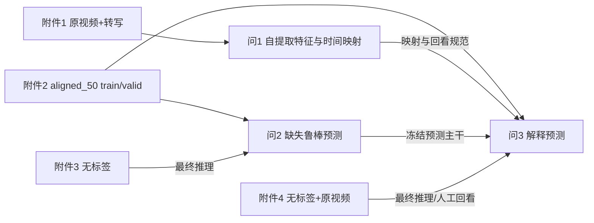

# 赛题翻译报告 · 2026 E 复杂场景下多模态情感预测的数学建模与算法设计

> 依据：本地《复杂场景下多模态情感识别的数学建模与算法设计.docx》正文及其补充说明；题面内正式标题使用“预测”。本报告的 S 编号是本队索引，不是官方编号。更新：2026-09-24。

## 0 赛题档案

| 项目 | 内容 |
|---|---|
| 年份、题号 | 2026年中国研究生数学建模竞赛 E 题 |
| 题目全称 | 复杂场景下多模态情感预测的数学建模与算法设计 |
| 命题方 | 题面未标注，不按题号推断 |
| 题型族 | 视频多模态时序表示、局部缺失鲁棒预测、可回看解释 |
| 赛程 | 四天竞赛；以当届正式安排为准 |
| 输入边界 | 题给 CMU-MOSEI 系列数据；允许开源工具与预训练模型做特征提取和建模，但须披露名称、版本、参数与用途 |

## 1 逐句解释

下表保留关键原句；背景段按论证功能合并，任务、数据、补充说明和提交规则逐项索引。原句保留题面用词和标点。

| 句号 | 原文 | 白话解释 | 要素类型 | 风险提示 |
|---|---|---|---|---|
| S01 | “本题以CMU-MOSEI英文多模态情感数据集为基础，围绕多模态特征提取与时序对齐、模态缺失条件下的鲁棒预测、可解释性情感预测三个层级开展系统性建模研究。” | 三问是一条逐层增加要求的链条。 | 背景/依赖 | 不应写成互不相关的三个算法。 |
| S02 | “video_id和clip_id共同确定一条视频样本。” | 附件1主键是二元组。 | 定义/数据 | 只用 clip_id 会撞键。 |
| S03 | “所有视频时长介于2.648秒和34.567秒之间。” | 问1必须处理不同长度的片段。 | 数据口径 | 固定50位不能直接声称每位代表同样真实秒数。 |
| S04 | “text列为该视频片段对应的英文转写文本；label列为连续情感强度标注，取值：[-3,0)（负向）、0（中性）、(0,3]（正向）” | 转写是题给文本；强度是连续变量。 | 定义 | ASR是核查辅助，不应覆盖题给转写。 |
| S05 | “0仅属于中性，不同时归入负向或正向。” | 三分类由强度符号定义时，零值只归中性。 | 硬约束 | 不能用二分类阈值混同中性。 |
| S06 | “参赛队不得自行替换、增补、删除或修改样本及其标签” | 问1异常样本只能记录并掩码处理。 | 硬约束 | 不得因静音、转写不匹配删样本。 |
| S07 | “包含对齐和非对齐各4850条样本” | 附件2两种组织版本各有同一规模的建模样本。 | 数据口径 | 不可把两套版本相加为9700条独立样本。 |
| S08 | “模态缺失指样本局部信息不可用，即一个或多个模态中存在特征值全部为零的随机连续序列区间。” | 附件3重点是有效序列中的连续零段。 | 定义 | 零段仍须排查填充、抽取失败和低活动信号。 |
| S09 | “三模态信息完整。” | 附件4按题面设定用于完整模态解释。 | 数据设定 | 实测某条视觉全零时应记录数据例外，不能虚构视觉证据。 |
| S10 | “参赛队应在训练、验证和专项测试中保持同一特征版本和同一输入接口。” | 选 aligned 或 unaligned 后全链路一致。 | 硬约束 | 训练 aligned、专项改读 unaligned 无效。 |
| S11 | “模型须明确原始样本的处理流程、各模态情感特征的定义与提取方法、跨模态时序对齐的规则与实现逻辑。” | 问1需要可复现的端到端流程。 | 问1交付 | 不能只交已有 pkl 或工具名。 |
| S12 | “一是原始样本覆盖完整性，包括样本编号、模态文件与输出特征是否一一对应” | 问1需要100条主键到输出文件的双向核查。 | 问1交付 | 只展示案例不够。 |
| S13 | “二是时序组织的可核验性，包括序列位置、有效长度、填充规则及其与原始素材的对应记录” | 需要保存时间映射、有效位和填充规则。 | 问1交付 | 序号不自动等于原视频秒数。 |
| S14 | “三是方法的合理性与可复现性，包括特征提取工具、关键参数、处理日志和复现实验说明。” | 软件版本、配置、异常日志与运行命令都应留存。 | 问1交付 | 只有特征包不能完全复现。 |
| S15 | “模态局部缺失指文本、语音或视觉中的部分连续时间段不可用，并不表示整个模态完全不存在。” | 问2缺失实验应在有效范围制造局部块。 | 问2定义 | 全模态消失可作额外压力测试，不能替代题设。 |
| S16 | “模型需在局部模态信息不完整的条件下稳定输出情感极性与情感强度预测，并分析缺失模态类型、缺失位置、缺失时长对预测性能的影响规律。” | 分类、回归和分层鲁棒性分析缺一不可。 | 问2交付 | 单一总分不足。 |
| S17 | “使用所建立的鲁棒性情感预测模型，对附件3中的测试样本完成推理预测” | 冻结模型后输出附件3每条预测。 | 问2交付 | 附件3无标签，不能反馈调参。 |
| S18 | “可解释性指模型在给出情感预测结果的同时，能够以可量化、可复核的方式说明本次判断主要依据了哪些输入信息” | 问3解释必须可量化并能回看。 | 问3定义 | 注意力图本身不等于真实原因。 |
| S19 | “包括不同模态在当前样本中的作用差异、对预测起主要作用的模态，以及各模态中与判断密切相关的局部片段。” | 三模态作用、主模态、局部证据均需逐样本输出。 | 问3交付 | 只做全局平均贡献不足。 |
| S20 | “关键证据需可对应至原始文本片段、语音时段或视觉关键帧。” | 解释需要原素材映射和定位质量。 | 问3交付 | pkl本身无秒级时间戳，估计时间须标注。 |
| S21 | “问题2与问题3的模型均在附件2提供的训练集上学习模型参数，在验证集上选择模型结构、超参数与决策阈值；附件3、附件4为无标签专项测试集，仅用于相应专项模型的最终推理预测。” | train学习、valid选择、专项只推理。 | 硬约束 | 专项样本不能报告准确率或用于再训练。 |
| S22 | “分类任务（情感极性）采用准确率（Accuracy）、F1值评价，回归任务（情感强度）采用平均绝对误差（MAE）、皮尔逊相关系数评价。” | 四项指标至少齐全；F1应说明平均方式。 | 评价口径 | 不能只报准确率。 |
| S23 | “以表格形式汇总附件1全部100条样本的特征提取结果” | 论文正文应有100条全量表。 | 问1正文 | 不能只放附件。 |
| S24 | “全量原始特征文件随附件提交。” | 问1自生成特征必须进入最终附件。 | 附件交付 | 压缩包需预先量大小。 |
| S25 | “缺失模态类型、缺失率对预测性能影响的规律分析与消融实验结果” | 问2至少有类型×强度分层与消融。 | 问2正文 | 需记录实际遮蔽率，非仅标称率。 |
| S26 | “主要参考模态内局部片段重要性分布可视化、三模态作用差异对比分析” | 问3还要图和横向比较。 | 问3正文 | CSV本身不替代图表。 |
| S27 | “总附件大小须符合竞赛统一要求（≤50MB），所有提交材料中严禁出现参赛单位、队员姓名、队伍编号等身份信息” | 附件容量和匿名性为提交门槛。 | 硬约束 | 最终包与正文都需扫描。 |
| S28 | “本题所有建模任务均以赛题提供的CMU-MOSEI系列数据为唯一数据来源” | 不引入外部情感数据参与训练或调参。 | 硬约束 | 开源预训练模型可用，但用途须说明。 |
| S29 | “text_bert | BERT三路整数输入，3×50 | 词元编号、注意力掩码和分段编号，需经BERT编码后使用；与text二选一，不构成第四种模态” | 必须先验证词表与 token ID 协议。 | 数据口径 | 不能把三个通道当三个文本模态。 |
| S30 | “附件2保存的是处理后的数值特征和标签，不保存原始视频帧、音频波形或逐词时间戳。” | 问3秒级定位需另外建立和核查。 | 数据边界 | 不可把对齐位置等同官方时间戳。 |

## 2 定义表

| 术语 | 操作性定义 |
|---|---|
| 样本主键 | 附件1是 `(video_id, clip_id)`；附件2通常为 `video_id$_$clip_id` |
| 情感极性 | Negative/Neutral/Positive，标记 0/1/2；零强度仅为中性 |
| 情感强度 | 区间 [-3,3] 的连续标注，预测和评价单独处理 |
| 对齐版 | 文本、声学、视觉最多50个相互对应的序列位置；不自带秒数 |
| 未对齐版 | 文本50位，声学、视觉各最多500位，按各自有效长度处理 |
| 填充掩码 | 超出真实有效长度的位置 |
| 观测掩码 | 有效范围内当前是否有可用数值证据；全零成因须另核查 |
| 人为缺失掩码 | 训练/压力测试中主动遮挡的位置及随机种子，可追溯 |

## 3 约束表

| 类别 | 内容 | 当前落实 |
|---|---|---|
| 硬 | 附件1不得更动样本和标签 | 100条保留；异常只记审查结果 |
| 硬 | 问2、3同一 aligned/unaligned 版本 | 目前均选 aligned_50 |
| 硬 | train学习、valid选择、附件3/4只推理 | 新模型按此执行；旧线性模型曾查看 A2 test，论文不得宣称新模型独立 test 提升 |
| 硬 | 禁止题外情感数据参与训练/调参/统计 | 现有训练只用题给数据；预训练BERT仅作固定编码 |
| 硬 | 论文覆盖三问，核心代码与特征随附件；附件≤50MB且匿名 | 尚未制作最终包和论文 |
| 软 | 开源提取器、预训练模型可用 | 须列软件版本和核心参数 |
| 软 | 典型案例展示 | 题面至少问1一例、问3典型解释卡 |

## 4 数据口径表

| 附件 | 角色 | 规模/结构 | 关键观察 |
|---|---|---|---|
| 1 | 问1原视频、题给转写及标签 | 100段，37个 video_id 文件夹 | 低匹配和静音仍保留；人工复核见《12》 |
| 2 | 问2/3训练、验证和标准测试 | aligned与unaligned各4850；train3395/valid728/test727 | 特征和标签分字段批量存放，不能写 `data['train'][j]` |
| 3 | 局部缺失无标签专项 | 30条，同版本接口 | 原始零段成因未知；只能给预测 |
| 4 | 解释无标签专项 | 20条与20段原视频 | 13号视觉全零；时间映射多为ASR估算 |

附件2的音频74维具体物理含义未给出，不反向命名。表1中的50是序列长度，不是每条片段固定50秒。text和text_bert是两条可选文本编码途径，不叠加为两个模态。

## 5 交付要求表

| 问题 | 论文正文 | 附件文件 | 证明材料 |
|---|---|---|---|
| 1 | 流程、三模态定义、全100条表、至少1例对齐、版本参数 | 自生成100条三模态时序特征 | 主键、有效长度、填充、原素材映射及日志 |
| 2 | 网络、损失、训练、四指标、缺失规律、消融、误差分析 | 附件3全量预测CSV、代码、模型、配置 | 固定valid结果和实际遮蔽率 |
| 3 | 解释方法、典型卡、局部重要性图、三模态比较、验证误差 | 附件4全量预测与解释CSV、代码、模型、配置 | 原视频回看和定位质量标记 |
| 全题 | 官方格式论文、AI工具使用披露 | ≤50MB匿名附件 | 文件清单、运行说明、压缩包复核 |

## 6 跨问题依赖图

## 7 待澄清清单

| 编号 | 歧义点 | 理解A | 理解B | 分支影响 | 建议 |
|---|---|---|---|---|---|
| C01 | 附件4称“三模态信息完整”，实测13号视觉全零 | 有效但恰为零 | 抽取失败或缺失 | 决定解释可否归因视觉 | 不推断成因；页面标“无视觉证据”，人工回看原视频 |
| C02 | 附件3零值连续区间成因 | 人为局部缺失 | 原始低活动/抽取失败/填充 | 鲁棒性解释不同 | 将题设与可观测零段分开描述 |
| C03 | 附件4的50位对应何种原视频时刻 | 有官方词级时戳 | 仅模态对齐序号 | 关键证据秒数精度不同 | 现有文件无逐词时戳；标ASR估计并人工回看 |
| C04 | 官方当届论文模板和队伍编号 | 已取得 | 尚未提供 | 已收到模板与队号；最终版式仍待核 | 按原模板做正文、摘要和匿名审查 |
| C05 | 题面内“预测”和文件名“识别” | 题面内标题为准 | 当届模板有另一正式标题 | 封面名称可能不一致 | 以官方最终模板核对，不擅改题面标题 |

## 8 遗漏审计

已映射四组附件、三问、标签边界、两种数据版本、训练/验证/专项边界、四指标、100条全量表、典型案例、局部可回看解释、外部数据限制、代码模型配置、≤50MB匿名要求。题面参考文献只是提供背景，不自动作为已核实论文文献；引用时逐条查原文。已取得当届模板、队号和附件4人工审查CSV；尚需核验最终渲染、附件实际压缩大小和引用文献。

## 9 一句话题意

在题给数据范围内建立可追溯的三模态时序表示，用同一版本特征完成局部缺失下的情感预测，并把解释证据回映至原视频。
